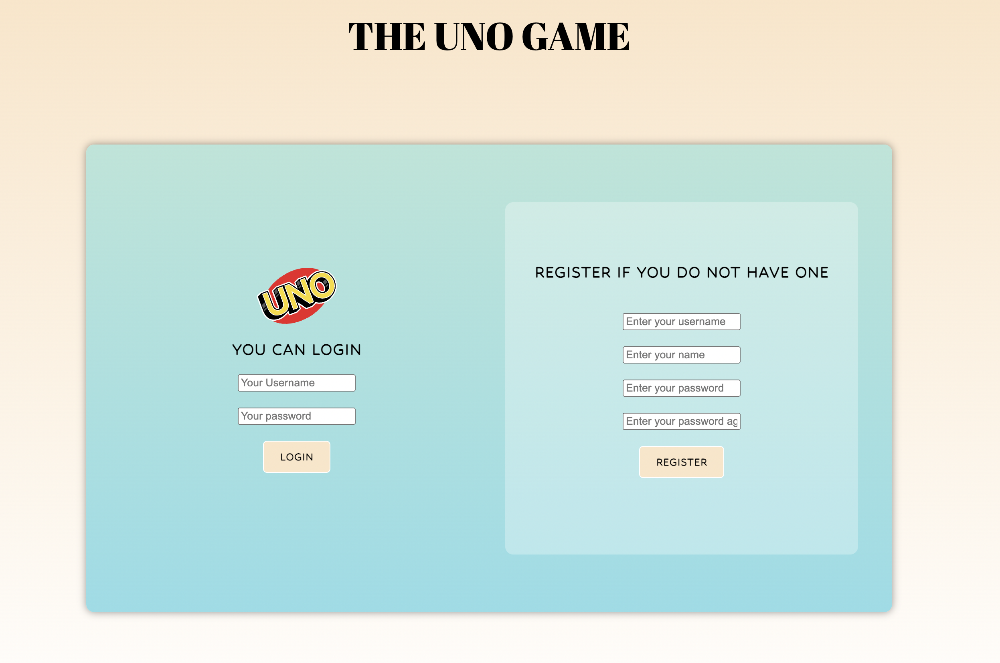

## UNO GAME

run node app on directory uno-game and call localhost:3000 if running on local
### Game instructions
1. Your goal is to get rid of all your cards as soon as possible 
2. You can only play cards that have the same color or number as the top card in the discard pile, unless you want to play a black card. Then, you can play it any time you like 
3. You can draw a card during your turn if you cannot or don't want to play your cards 
4. Each player has one and a half minutes to use. The timer starts when it is your turn, and stops when it is your opponent's turn 
5. You lose if your timer runs out first. So, think fast! 
6. After you play your second-to-last card, a red and yellow UNO button appears for you, and a black and white "U,NO!" button appears for your opponent 
7. If you click your button first, you are save. If your opponent clicked his/her button first, you will get two more cards! 
8. You win if you get rid of all your cards first 
9. You can also cheat by pressing <kbd>Space</kbd>. It makes your opponent's timer go faster😈 
10. You get 0 points if you lose. If you win, the points you get is the number of cards left in your opponent's hand 

This is a two-player UNO Game using HTML, CSS, Javascript to build the frontend and Node.js to build the backend. Technologies like web socket is used here to have interactive communication between server and client.

There is a user authenication system at the beginning. Session cookies are used to keep track of the sessions of the users

Each player can only see its own card and number of cards with their components, there is a timer for each of the player. If time runs out, you lose! If cards used up, you win!

User can change the theme of the color if they draw a change color card

If one player has a UNO card left, a UNO button will poped up for both users, if the player that has one card left press the button faster than the other player, nothing will happen. If he press slower than the other player, he will get two more cards

A scoreboard will be poped after the game ends

